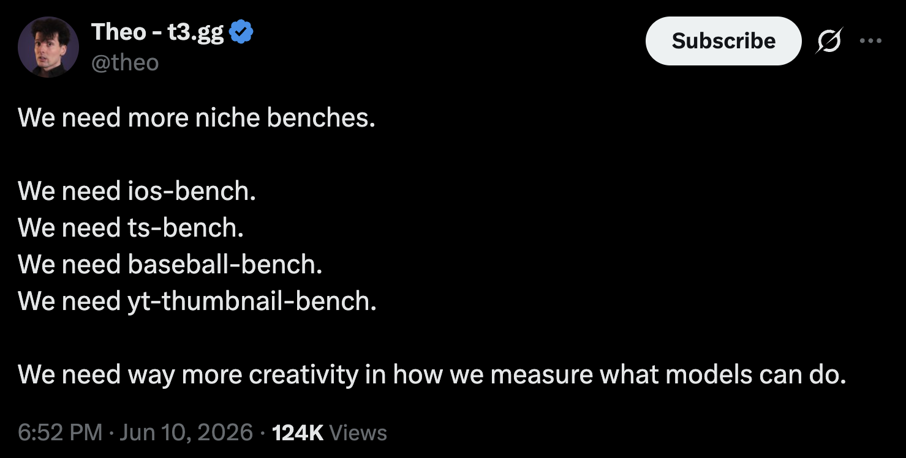

# Introducing GitBench

<!-- Temporary outline -->

- intro
- why?
  - inspiration, artificialanalysis.ai
  - GitKraken AI (commit message generation, commit composer, etc)
  - fun (dev wanted to try some AI planning tools)
- what?
  - CLI tool
  - web app for data viz
- how?
  - the dev process
    - vibe coded
  - GSD2 -> Openspec
  - Openrouter
- Happy little surprises
  - Structured output (nerd sniped)
    - Some models don't even support this
    - some give broken json output sometimes
  - LLM as judge (commit_message generation)
  - Semantic scoring as the wrong approach (conflict resolution)
  - NSFW content (need to scrub)
- Some Results
  - light analysis
  - CTA for full analysis (email capture for PDF delivery)

<!-- end outline  -->

<!-- Citations -->

- Theo tweet: We need more benchmarks: https://x.com/theo/status/2064888448964857929

<!-- end citations -->

LLMs these days have gotten really good at some of the benchmarks that are available. There are benchmarks like [Humanity's Last Exam](https://agi.safe.ai/) that test general knowledge and reasoning. The largest frontier models are best suited to that test because of the huge corpus of training data they have been built on top of. Then there are more coding focused tests like [SWE-Bench](https://www.swebench.com/) which comes in several flavors like Verified and Pro and tests a models ability to come up with a similar Pull Request and code change for Issues that have already been resolved on various codebases.

All these benchmarks help us understand the capabilites and limits of many of the models that exist today. There is speculation that some of the models and creators of models are "benchmaxxing" which is really just the model focusing on solving those specific benchmarks rather than focusing on improving their general intelligence instead. One way we can combat benchmaxxing is by creating more specific benchmarks and so many of them that optimizing for them is too costly to pursue.

Take this [Theo tweet](https://x.com/theo/status/2064888448964857929) for example:


## Inspiration

The Theo tweet is actually somewhat recent compared to when we started building GitBench. We tend to use [artificialanalysis.ai](https://artificialanalysis.ai) for a reference when new models come out. This could be for our dev team to understand which models are worth the session limit cost or it could even be about which models we think should be best used for various parts of GitKraken AI, whether that is:

- Commit Message Generation
- Pull Request Generation
- Merge Conflict Resolution
- Automated Rebasing
- Commit Composer
- and more

What we realized, is that there isn't a specific benchmark that helps us evaluate which models are more capable and efficient than others for these specific things. Of course, we use some evals in the way that Braintrust, Arize, and others mean that term, but to create evals for all of these things is a very involved effort and the results are a lot harder to share.

Another reason, we made it was because I thought it sounded like a lot of fun to make. I haven't really tried my hand at research like this and building out the harness, fixtures, and results web app was a great experience even if an LLM wrote most of the code.

## What's in a GitBench? Would a benchmark by any other name still be as Git?

GitBench started out as just a CLI to run the benchmarks. We needed to output JSON into a format that Artificial Analysis might be able to consume, if if a long shot. But then we realized we needed some kind of web app to truly visualize things.

The CLI is built with python since that seemed like the common choice for things like this in the AI and ML space. I'm not the greatest python dev, but I can get enough done that I felt confident I could review the code as we iterated. Building CLIs in python can be as simple as some argparse functionality, but I have come to expect a bit more of a developer experience from frameworks/libraries in other languages, so we opted for [click](https://click.palletsprojects.com/en/stable/). While the benchmarks run, we also wanted some nice output to keep up with the progress and status of the individual models.

The web app is its own beast. We wanted to consume the results.json into it, but we needed the data to be explorable as well as statically rendered for SEO which naturally led to using [Astro](https://astro.build). The graphing is done with recharts and the components are [shadcn/ui](https://ui.shadcn.com/) because their lack of needing a React Context makes them play well with frameworks like Astro.

### How Was GitBench Made?

~~GitBench is an experiment. Several people have helped build and critique the product you see right now. In general, I (Chris Griffing), chatted and chilled with my chat and ~~

### The Planning Process

So, we just went over what's under the hood of GitBench, but that doesn't really describe the dev process enough. It actually started out of a desire to try a bunch of the spec-driven development frameworks. If you don't know what I mean by "spec-driven development framework", here are some links:

- [BMAD](https://github.com/bmad-code-org/bmad-method)
- GSD
  - [GSD](https://github.com/gsd-build/get-shit-done)
  - [GSD-2](https://github.com/gsd-build/gsd-2)
  - [NEW]()
- [Openspec](https://openspec.dev/):
- [Spec-kit](https://github.com/github/spec-kit)

#### Other Frameworks

- PAUL
- Superpowers

### Vibes for sure

Since the idea behind this project was to use a planing tool, we have maintained a vibe driven approach to this codebase. There is room to improve and we welcome contributions.

### GSD-2 to Openspec

We used GSD-2 for a bit because the premise was really appealing. It was using the same "mentality" of GSD with a fully controlled implementation of the [pi sdk](https://pi.dev/docs/latest/sdk). However, after a while, GSD-2 seemed to start forgetting where its own files should be and ignoring them when they were actually there. Maybe this was an outdated set of skills or something more complicated than that.

This is where [Openspec]() saved the day. It's a fantastic planning tool to jump into any non-greenfield situation you throw at it. In this case, it was able to do an "explore", create a "proposal", and "apply" it.There are plenty of other workflows, but this worked for the rest of the dev flow.

### Openrouter, Oh me-oh-my!

At this point, you might be wondering where we are going to test these models. Well, [OpenRouter](https://openrouter.ai) has access to almost every model you could possibly care about. We couldn't possible test every single model that OpenRouter provides so we pick and choose which new models we test beyond our initial baseline. Our current config still leaves room for other providers, especially if they support the [OpenAI SDK]() or other compatible SDKs, but we think we are at least covering our bases.

## Happy Little Surprises 

You might not have predicted it, but we found a bunch of strange edge cases related to how we handled all parts of our workflow.

### Structured Output (?)

I was at a conference recently and I was explaining GitBench to a few people. One person I respect responded to me mentioning that some models are really bad at following directions.They suggested that maybe underperforming models would perform better if given better guidelines. Without spoiling too much, I will say the results are really worth thinking about and we would love to chat more if we could test things better.

If you don't know what structured output is, you can think of it as a set of instructions you provide to a model that HEAVILY encourage it to spit out a JSON structure that matches what you asked for.

One thing we didn't predict was some models not supporting structured output in any way. It was pretty rare and seemed isolated to some of the smaller models. Nonetheless, that was a fun problem to adapt to.

Another problem we ran into was that some models would response with output that looks plausible from a distance until you actually look at it. Example:

```json
{
  "The response we were expecting"
}
```

That isn't event valid JSON. So we had yet another set of things to adapt to.

  <!-- Maybe a spot for the link to the results -->

### LLM as Judge

We vibed a lot of this project in the beginning, so when we started digging into the code and seeing how some of the tests were run, we saw that the `commit_messages` suite was using a string similarity algorithm that could have some interesting false positives and negatives. Luckily, LLMs are pretty good at judging the output of each other, so we employed `gpt-oss-120b`, `,  and ` to validate the results. This lead to a much more predictable result after averageing the scores between the judges.

<!-- OOOOOOF:::: I think that Im mixing up the llm as judge stuff with the string/semantic matching thing. -->

<!-- NEXT -->

### Nemotron Moonlights as a Danielle Steele Ghostwriter

You think that sounds extreme. We agree. It is actually worse. It's ok. Nemotron is just seemingly trained on a very different data set. In a tamer run, Nemotron didnt go an NSFW route, but it did respond to one of the same prompts with a "Create Your Own Quiz" app architecture and it got REALLY specific.

Naturally, we had to redact NSFW content from our reports. We caught it before it became a problem, which was fortunate. But that meant yet another iteration on the data gather process that needed to be tested, validated, and then rerun on a larger scale.

## The Results

You can see the results yourself at [GitBench](https://gitbench.gitkraken.com). We don't want to gate the raw results in any way. So, please browse the previous link as much as you want. However, we do think that there is something special about a partial analysis of the date we all see.

### Teaser 1

### Teaser 2

### Teaser 3

## Subscribe for Future Analysis

<!-- The CTA form -->
